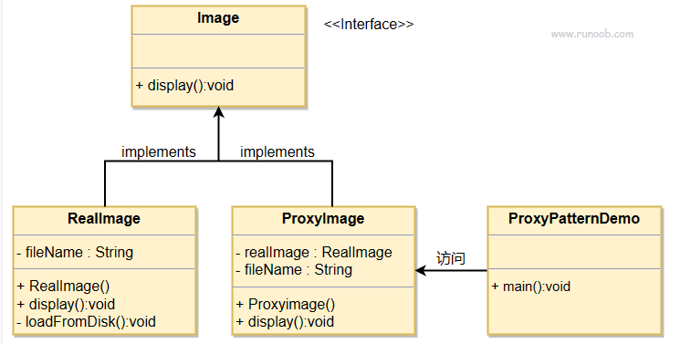

# 代理
	通过一个对象访问另一个对象可以理解为代理
## 代理的介绍
### 什么是代理模式
	代理模式是23种设计模式中的一种，类似生活中的中介，由代理对象控制原目标对象的访问，在代理对象中我们可以实现对目标对象功能的增强，拓展
1. 意图：为其他对象提供一种代理以控制对这个对象的访问
2. 主要解决：在调用层直接访问对象时带来的问题，比如说：要访问的对象在远程的机器上（远程代理（Remote Proxy））。在面向对象系统中，有些对象由于某些原因（比如对象创建开销很大（虚拟代理（Virtual Proxy）），或者某些操作需要安全控制（保护代理（Protection Proxy）），或者需要进程外的访问（智能代理（Smart Proxy））），直接访问会给使用者或者系统结构带来很多麻烦，我们可以在访问此对象时加上一个对此对象的访问层。
3. 优点：1、职责清晰。2、高拓展性。3、智能化。
4. 缺点：1、由于在客户端和真实主题之间增加了代理对象，因此有些类型的代理模式可能会造成请求的处理速度变慢。 2、实现代理模式需要额外的工作，有些代理模式的实现非常复杂。
## 为什么需要代理
	因为一个良好的设计不应该被轻易的修改，这是开闭原则的体现，也是面向对象语言中封装特性的体现：一个良好的设计应该对修改关闭，对拓展开放。代理正是为了拓展类而存在，通过代理对象我们可以控制对现有类（也就是目标类）的访问。

## 实现
我们将创建一个 _Image_ 接口和实现了 _Image_ 接口的实体类。_ProxyImage_ 是一个代理类，减少 _RealImage_ 对象加载的内存占用。_ProxyPatternDemo_ 类使用 _ProxyImage_ 来获取要加载的 _Image_ 对象，并按照需求进行显示。

### 作用
1. 功能增强: 在原有的功能上，增加了额外的功能
2. 控制访问：我们并没有直接访问realimage类，而是通过代理类（proxyImage）访问
3. 安全：代理类可以在不更改被代理对象的情况下去增加功能
# 实现代理的方式
## 静态代理和动态代理
### 静态代理
#### 什么是静态代理
1. 代理类是自己手工实现的，自己创建一个Java类，表示代理类。
2. 同时我们所要代理的目标是确定的。（写死的）
#### 特点
1. 实现简单
2. 容易理解
#### 缺点
当页面中我们需要代理的目标类和代理类很多的时候会出现一些问题：
1. 当目标类增加了，代理类可能也需要成倍的增加，代理类数量过多。
2. 当接口中的公共的功能增加或者修改的时候，这个接口下的所有的实现类都要修改，影响很大
### 动态代理
#### 什么是动态代理
动态代理指代理类不写在代码中，而是在运行过程中产生，java提供了两种动态代理，分别是jdk的动态代理和基于CGlib的动态代理。
动态代理的优点：动态代理与静态代理相比较，最大的好处是接口中声明的所有方法都被转移到调用处理器一个集中的方法中处理（InvocationHandler.invoke）。这样，在接口方法数量比较多的时候，我们可以进行灵活处理，而不需要像静态代理那样每一个方法进行中转。而且动态代理的应用使我们的类职责更加单一，复用性更强

#### 动态代理的两种实现方式
1. JDK 动态代理
2. CGLIB动态代理
#### jdk动态代理
JDK动态代理对象不需要实现接口，但是要求目标对象必须实现接口，否则不能使用动态代理。  
JDK中生成代理对象主要涉及的类有

* java.lang.reflect Proxy 主要方法为
	public static Object newProxyInstance(ClassLoader loader,  //指定当前目标对象使用类加载器
                                      Class<?>[] interfaces,  //目标对象实现的接口的类型
                                      InvocationHandler h) //事件处理器
*  java.lang.reflect InvocationHandler，主要方法为
 Object    invoke(Object proxy, Method method, Object[] args) 
  // 在代理实例上处理方法调用并返回结果。